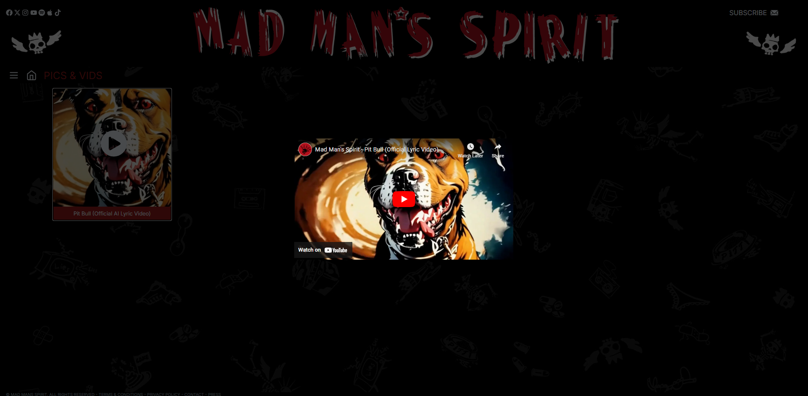

### MMS stands for Mad Man Spirit.

It is a new music rock band from the United Kingdom. This was the first version, which is today less maintained, because the production version today has closed rights. This will still give a good overview of the functionality and idea of a new band.

The small platform offers some navigation through the features for all resolutions

Listeners of MMS can collect some info and news about albums or events of the band.

### Music
The heart of the platform is of course music. MMS shares its music through Apple Music, Spotify and Amazon. The platform gives a free look into it

There is also a free version of the music on YouTube

### Admin interaction
Despite the platform size, it offers its owner a minimal, simpel interface to create sen Albums, News, Songs and its lyrics without contacting IT service

This includes Authorisation in its simplest shape.

Alongside with what has already been mentioned. There are also
- Contact form submission
- Subscription for news notification

In the new closed version there will be SEO modules for promotion. Store and option for live-streaming. 

###### P.S. Stay tuned 